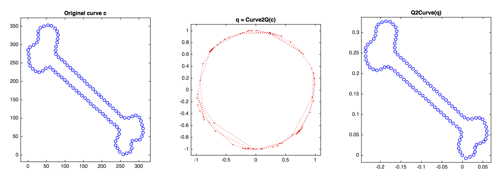

Sources:

- Joshi, et al., [*A Novel Representation for Riemannian Analysis of Elastic Curves in $\mathbb{R}^n$*](http://dx.doi.org/10.1109/CVPR.2007.383185), CPVR 2007.

Implementations are in Matlab from [Statistical Shape Analysis & Modelling Group, Florida State University](http://ssamg.stat.fsu.edu/software)

## The $q$-curve ##

Let $I = [0, 2\pi]$ be a unit interval and $\beta: I\to \mathbb{R}^n$ be an $\mathbb{L}_1^2(I)$ function. A function $f$ is called $\mathbb{L}_1^2(I)$ function if both $f$ and its derivative $f'$ are $\mathbb{L}^2(I)$ functions, or a [*square-integrable* function](http://mathworld.wolfram.com/L2-Function.html). This means that
$$
  \left|f\right|^2 = \int_{I} \left|f\right|^2 \textrm{d}\mu
$$
with respect to a measure $\mu$, exists and finite. Note that the integral is called Lebesgue integral. The [$\mathbb{L}^2(I)$ space](http://mathworld.wolfram.com/L2-Space.html) is a [*Hilbert space*](http://mathworld.wolfram.com/HilbertSpace.html).

The function $\beta$ is an elastic curve that can be stretched, shrunk and bent freely. Hence, we reparameterise $\beta$ by its derivative $\dot{\beta}$ into a curve $q : I\to\mathbb{R}^n$ that
$$
  q(s) = \frac{\dot{\beta}(s)}{\sqrt{\left|\left| \dot{\beta}(s) \right|\right|}}
$$
where $\left|\left|\cdot\right|\right| = \sqrt{\left<\cdot,\cdot\right>_{\mathbb{R}^n}}$ and $\left<\cdot,\cdot\right>_{\mathbb{R}^n}$ is a standard Euclidean dot product in $\mathbb{R}^n$.

```
function q = Curve2Q(p)
% calculate the first derivative
[n,N] = size(p);
for i = 1:n
    v(i,:) = gradient(p(i,:),1/N);
end

% normalised the gradient
for i = 1:N
    L(i) = sqrt(norm(v(:,i),'fro'));
    if L(i) > 0.00001
        q(:,i) = v(:,i)/L(i);
    else
        q(:,i) = zeros(n,1);
    end
end

% output the Q
q = q/sqrt(InnerProductQ(q,q));
```

```
function v = InnerProductQ(q1,q2)
% check the dimension
if( ~isequal(size(q1),size(q2)) )
    error('Mismatched dimension between the two Q curves');
end

T = size(q1,2);
v = trapz(linspace(0,1,T),sum(q1.*q2));
```

The scalar magnitude $||q(s)||$ is the square-root of the instantaneous speed and the normalised vector $q(s) / ||q(s)||$ denotes the instantaneous direction along the curve.

To recover back $\beta$ from $q$:
$$
  \beta(s) = \int_0^S \left|\left|q(t)\right|\right| q(t) \textrm{d}t
$$

```
function p = Q2Curve(q)
% compute the norm of each row (dimension)
[n,T] = size(q);
for i = 1:T
    qnorm(i) = norm(q(:,i),'fro');
end

% compute the integral
for i = 1:n
    p(i,:) = cumtrapz( q(i,:).*qnorm )/T;
end
```

**Note** that when $\beta$ curve is converted to $q$-curve, it normalises the scale. Thus, the recovery back from $q$ to $\beta$ does not retain the original scale (see the figure below). Interesting to see that the space of $q$ is on a sphere, because $q$ curve is defined as the gradient of $\beta$.



## Pre-shape space of $q$-curves ##